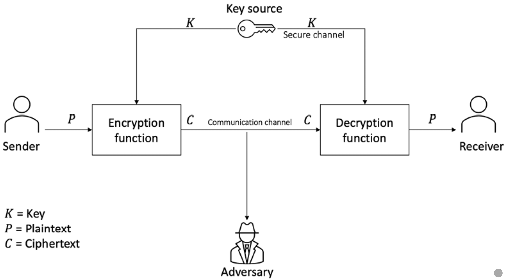

# Cryptography

> **Cryptography**:
>
> science of making information secure in the presence of adversaries

**Ciphers**:  algorithms used to encrypt or decrypt data&#x20;


Securing a blockchain ecosystem **requires many different cryptographic primitives**.

* hash functions
* symmetric key cryptography
* digital signatures&#x20;
* public key cryptography


<figure><figcaption>
Generic encryption and decryption model
</figcaption></figure>

## Services provided by cryptography&#x20;

### 1. Confidentiality&#x20;

> **Confidentiality**:
>
> the assurance that information is only available to authorized entities

### 2. Integrity

> **Integrity**:
>
> the assurance that information is modifiable only by authorized entities

### 3. Authentication&#x20;

> **Authentication**:
>
> provides assurance about the identity of an entity or the validity of a message

#### 2 types of authentication mechanisms

#### **1. Entity Authentication** &#x20;

> **Entity Authentication:**
>
> the assurance that an entity is currently involved and active in a communication session

* Single Factor Authentication
  * only one factor is involved — **something you know**
  * authentication with username and password
  * not very secure
    * password leakage
* Multi-Factor Authentication
  * use of additional factors for user identification
  * Method 1: **something you have + something you know**
    * something you have — hardware token or a smart card
    * user use both hardware token and login credentials to gain access to a system
      * hardware token lost/stolen --> no access
      * login password is forgotten --> no access
  * Method 2: **something you are + something you know**
    * something you are —  biometric features to identify user such as user's fingerprint, retina, iris, hand geometry


**Biometric systems** require careful implementation to ensure high security, as research shows they **can be bypassed** under certain conditions.


#### **2. Data Origin Authentication**

> **Data Origin Authentication - Message Authentication:**
>
> an assurance that the source of the information is indeed verified

_**`Guarantees Data Integrity`**_ — If a source is corroborated[^1], it confirms the data has not been altered.

Mechanisms/Methods used

* `MACs`: message authentication codes&#x20;
* digital signatures

### 4. Non-Repudiation

> **Non-Repudiation**:
>
> the assurance that an entity cannot deny a previous commitment or action by providing incontrovertible cryptographic evidence

* essential property in debatable situations whereby an entity has denied the actions performed,
  * e.g: placement of an order on an e-commerce system

#### Non-repudiation protocol&#x20;

* usually runs in a communications network
* provide evidence that an action has been taken by an entity on the network
* primary requirements
  * fairness
  * effectiveness
  * timeliness

#### 2 communications models used to transfer messages from originator A to recipient B

* A message is sent **directly** from originator A to recipient B&#x20;
* A message is sent to a **delivery** **agent** from originator A, which then delivers the message to recipient B

#### `MPNR`: M**ulti-Party Non-Repudiation**


In many scenarios, **multiple participants** are involved in a single transaction.&#x20;

e.g: electronic trading systems — clearing agents, brokers, traders, other entities&#x20;

&#x20;╰**--**➤ **multi-party non-repudiation** (**`MPNR`**) protocols&#x20;


### 5. Accountability&#x20;

> the assurance that actions affecting security can be traced back to the responsible party

provided by&#x20;

* logging and audit mechanisms: detailed logs with the date and timestamp and the entity’s identity&#x20;


**Log files** can optionally be **encrypted** and be **part of the database** or a standalone ASCII text log file on a system.


## Cryptographic Primitives

[^1]: verified as accurate through consistency with other reliable sources
