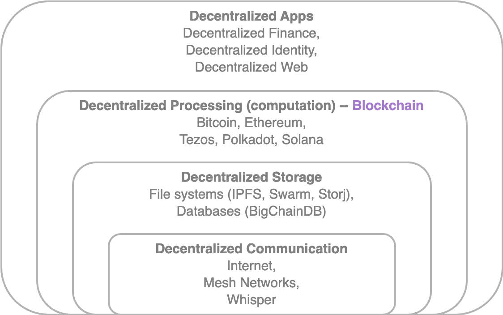

# Full-ecosystem Decentralization

Blockchain - a distributed ledger that runs on top of conventional systems&#x20;

* includes following elements&#x20;
  1. Storage
  2. Communication
  3. Computation
* and other factors such as
  1. Identity
  2. Wealth

## 1. Storage


[storage.md](storage.md)


## 2. Communication


[communication.md](communication.md)


## 3. Computation


[computation-computing-power.md](computation-computing-power.md)


## Decentralized Ecosystem

<figure><figcaption>
Decentralized Ecosystem
</figcaption></figure>


The **blockchain** has the potential to address various decentralization-related issues.


* Zooko's triangle concept related to identity requires a naming systems in network protocols that is secure, decentralized and capable of providing human-meaningful and memorable names to the users.&#x20;
  * Although there was an opinion that a system can have only two of these properties simultaneously, `Namecoin` addresses this issue.
  * However, challenges like user-stored private keys raise questions about the suitability of decentralization for specific problems.


Decentralization may not be suitable for every situation, as centralized systems with established reputations often perform better in many cases.


* Email platforms from reputable companies, offer better service than private internet hosting.


Blockchain technology enables the creation of Decentralized Organizations (DOs) as software versions of traditional physical organizations.


