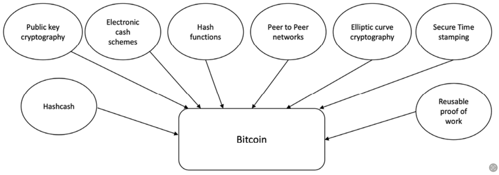

# Bitcoin

## Previous Attempts

✅ **Previous attempts** to create `anonymous and decentralized digital currency` were successful to some extent,&#x20;

❌ but they could not solve the problem of preventing `double spending in a completely trustless or permissionless environment`.&#x20;

## Ideas that supported the invention of Bitcoin and blockchain

<figure><figcaption>
Ideas that supported the invention of Bitcoin and blockchain [1]
</figcaption></figure>

* Hashcash
* Public Key Cryptography
* Electronic cash schemes
* Hash functions
* Peer to peer networks
* Elliptic curve cryptography
* Secure Time stamping
* Reusable proof of work

## Key innovation

Idea of an ordered list of blocks composed of transactions that is cryptographically secured by the PoW mechanism to prevent double-spending in a trustless environment

#### The Bitcoin blockchain which introduced the Bitcoin cryptocurrency, address the problems of&#x20;

* `Double spending` in a completely trustless or permissionless environment
  * `Distributed consensus in a trustless network:` by using **public key cryptography** **with** a **PoW** mechanism to provide a secure and decentralized method of minting digital currency
* SMR: `State Machine Replication` problem
  * Solves the problem by allowing the **replication of blocks at all correct nodes** and ensuring consistency via its **PoW** mechanism.&#x20;
  * Here, the agreement is reached between nodes (or replicas) repeatedly to append new blocks to the blockchain.

