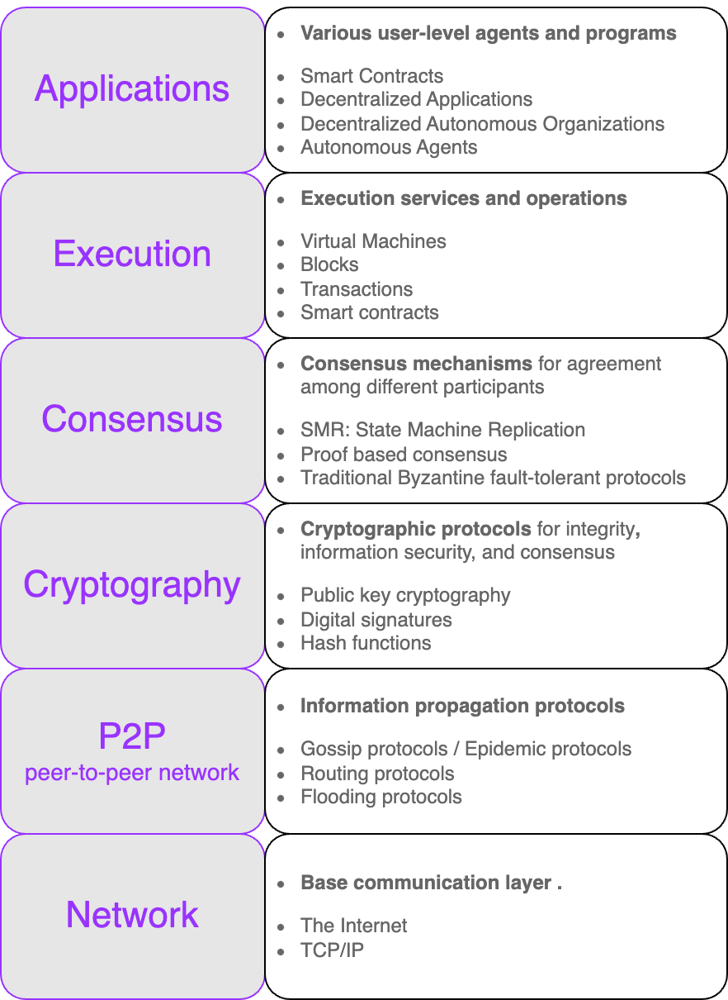

# Blockchain By Layers

> Blockchain can be seen as a
>
> — **layer of a distributed peer-to-peer network running on top of the internet** analogous to SMTP, HTTP, or FTP running on top of TCP/IP

<figure><figcaption>
The layered architectural view of a generic blockchain
</figcaption></figure>

<table data-header-hidden><thead><tr><th width="193" align="center">Layer</th><th align="center">Responsibility and Technologies Involved</th></tr></thead><tbody><tr><td align="center"><strong>Application</strong></td><td align="center">
Effectively contain all sorts of <strong>various user-level agents and programs</strong> that operate on the blockchain. 

Users interact with the blockchain via decentralized applications.

Technologies Involved:
<ul><li>Smart Contracts </li><li>Decentralized Applications </li><li>DAO's: Decentralized Autonomous Organizations </li><li>Autonomous Agents</li></ul></td></tr><tr><td align="center"><strong>Execution</strong></td><td align="center">
Provides <strong>execution services</strong> on the blockchain, and <strong>performs operations</strong> such as 
<ul><li>value transfer, </li><li>smart contract execution, and </li><li>block generation. </li></ul>

Technologies Involved:
<ul><li>
Virtual Machines 
<ul><li>Virtual machines such as Ethereum Virtual Machine (<code>EVM</code>), Ethereum WebAssembly (<code>ewasm</code>), and <code>Zinc VM</code> provide an execution environment for smart contracts to execute. </li></ul></li><li>Blocks </li><li>Transactions </li><li>Smart contracts</li></ul></td></tr><tr><td align="center"><strong>Consensus</strong></td><td align="center">
Concerned with the usage of various <strong>consensus mechanisms to ensure agreement among</strong> different <strong>participants</strong> of the blockchain. 

Technologies Involved:
<ul><li>SMR: State Machine Replication </li><li>Proof based consensus </li><li>Traditional Byzantine fault-tolerant protocols</li></ul></td></tr><tr><td align="center"><strong>Cryptography</strong></td><td align="center">
Contains crucial <strong>cryptographic protocols</strong> that ensure 
<ul><li>the integrity of blockchain processes, </li><li>secure information dissemination, and </li><li>blockchain consensus mechanisms. </li></ul>

Technologies Involved:
<ul><li>Public key cryptography </li><li>Digital signatures </li><li>Hash functions</li></ul></td></tr><tr><td align="center">
<strong>P2P</strong> 

peer-to-peer network
</td><td align="center">
Consists of <strong>information propagation protocols</strong> 

Technologies Involved:
<ul><li>Gossip protocols / Epidemic protocols </li><li>Routing protocols </li><li>Flooding protocols</li></ul></td></tr><tr><td align="center"><strong>Network</strong></td><td align="center">
Provides a <strong>base communication layer</strong> for any blockchain. 

Technologies Involved:
<ul><li>The Internet </li><li>TCP/IP</li></ul></td></tr></tbody></table>

&#x20;

