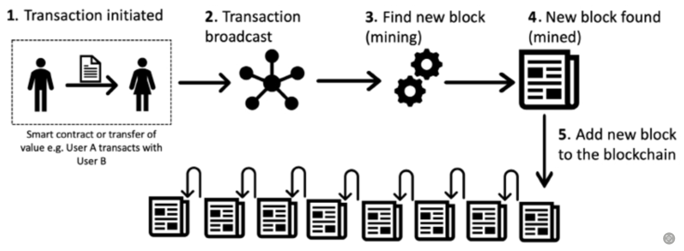

# Blockchain Functionality

## Consensus&#x20;

A critical decision that blockchain network must make -> figure out **which node will append the next block** to the blockchain.&#x20;

╰**---**➤This decision is made using a **`consensus mechanism`**

> **`Consensus:`**
>
> a process of **achieving agreement between distrusting nodes** on the final state of data
>
>
>
> **`Distributed Consensus:`**
>
> process of **attaining agreement on a common state** or value **among multiple nodes**
>
>
>
> **`Fault Tolerant Distributed Consensus:`**
>
> If distributed consensus mechanism **allows faults**&#x20;
>
> — Despite the failure of some nodes, agreement is reached between them.

Achieving blockchain consensus is challenging due to&#x20;

* the distributed nature of the network and&#x20;
* the need to coordinate multiple distrusting nodes

## The Process of Transaction Validation and Block Creation

1.  **Transaction is initiated**:&#x20;

    1. A node starts a transaction by **creating** it.&#x20;
    2. Then node **digitally signs** the transaction with node's private key.&#x20;

2.  **Transaction is validated and broadcast**:&#x20;

    1. A transaction is **verified** to ensure that it is valid.&#x20;
    2. Then it is propagated (**broadcast**) usually by using **data-dissemination protocols,** (e.g: Gossip protocol) to other peers that validate the transaction based on **preset validity criteria**.&#x20;

3. **Find new block:**
   1. Special participants on the blockchain network called **miners receive** the transaction and **validate** it.
   2.  Then miners **include** the transaction **in a block** and starts the **mining** process.

       * This process is also referred to as “`finding a new block`”
       * Here, nodes called **miners race to finalise the block** they’ve created by the mining process.

       &#x20;
4.  **New block found**:&#x20;

    1.  **Miner** **solves** a mathematical puzzle or fulfils the requirements of the consensus mechanism implemented in a blockchain

        — now, the **block** is considered “`found`” and `finalised`

        — the **transaction** is considered `confirmed`&#x20;

        * Usually, cryptocurrency miners are rewarded with a portion of the cryptocurrency they mine as an incentive for their efforts and the resources they expend in the mining process.

5.  **Add new block to the blockchain**:&#x20;

    1. The newly created block is **validated**
    2. **Transactions** or **smart contracts** within the newly created block are **executed**&#x20;
    3. **New block** is **propagated** to other peers&#x20;
    4. **Peers** also **validate** and **execute** the block.&#x20;

    — Now new block becomes part of the blockchain (`ledger`)&#x20;

    — the next block links itself cryptographically back to this block and the link is called a `hash pointer`

<figure><figcaption>
How a block is generated
</figcaption></figure>

