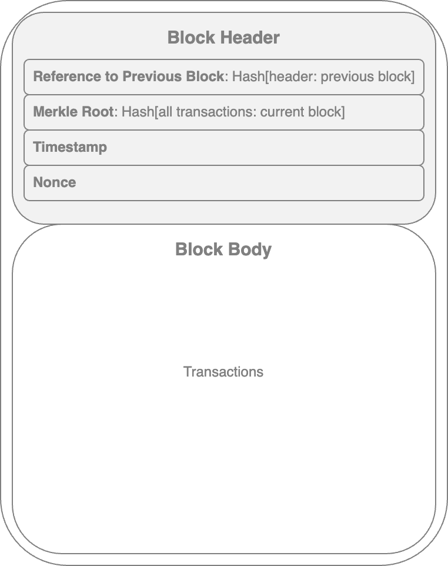
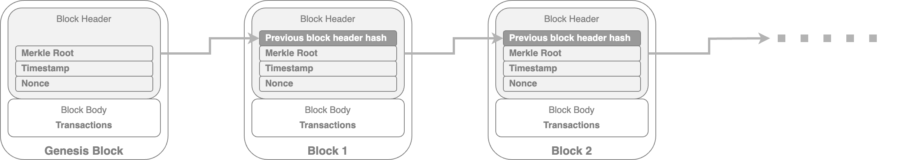
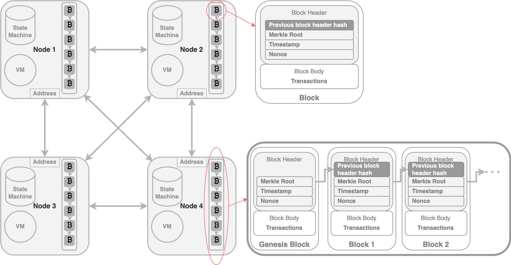

# Generic Elements of the Blockchain

## Elements Related to Blocks&#x20;

<table data-header-hidden><thead><tr><th width="152"></th><th width="591"></th></tr></thead><tbody><tr><td><strong>Address</strong></td><td><strong>Unique identifier</strong> used in a blockchain transaction to denote <strong>sender</strong> or <strong>recipient.</strong> Usually a <strong>public key</strong> or derived from a public key.</td></tr><tr><td><strong>Transaction</strong></td><td>
The <code>fundamental unit</code> of a blockchain.

 Represents a <strong>transfer of value</strong> from one address to another.
<ul><li>A <strong>record of an event</strong>/action in a blockchain; occurs between two or more parties.</li><li>E.g: The event of transferring cash from a sender’s account to a beneficiary’s account.</li></ul>

<ul><li>
A transaction can <strong>represent</strong> various 
<ol><li>[most commonly] a data structure that represents the <strong>transfer of value</strong> between users on the blockchain network. </li><li>a <strong>cryptocurrency transfer</strong> (transfer of value) </li><li>a <strong>smart contract invocation</strong> that can perform any desired operation</li></ol>

</li></ul><ul><li>
<strong>Data</strong> <strong>structure</strong> of a Transaction:
<ol><li>some logic of transfer of value</li><li>relevant rules</li><li>source address </li><li>destination addresses </li><li>other validation information</li></ol></li></ul></td></tr><tr><td><strong>Block</strong></td><td>
Composed of 
<ul><li>a <strong>block header</strong> and </li><li>a selection of <strong>transactions</strong> [block body]</li></ul>
<strong>bundled</strong> together and <strong>organized</strong> logically.

The structure of a block is dependent on the type and design of a blockchain.

Key Elements of a Block:
<ul><li>
Block Header:
<ul><li><strong>Previous Block Hash</strong>: reference to a previous block (<code>hash pointer</code>)</li><li><strong>Merkle Root</strong></li><li><strong>Timestamp</strong></li><li><strong>Nonce</strong></li></ul></li><li>
Block Body:
<ul><li>Transactions: A collection of individual transactions</li></ul></li></ul></td></tr><tr><td>Block Header: <strong>A reference to a previous block</strong></td><td>
The <strong>hash of the header of the previous block</strong>.

A reference to a previous block is included in the block <strong>unless</strong> it is a <strong>genesis</strong> block.
<ul><li><strong><code>Genesis block</code></strong>: The first block in the blockchain that is hardcoded at the time the blockchain was first started.  </li></ul>

</td></tr><tr><td>Block Header: <strong>Nonce</strong></td><td>
A <strong>number</strong> that is <strong>generated</strong> <strong>and</strong> <strong>used only once</strong>.

 Used extensively in many cryptographic operations to provide 
<ul><li>replay protection, </li><li>authentication, and </li><li>encryption.</li></ul>
In blockchain, it’s used in 
<ul><li>PoW consensus algorithms and </li><li>for transaction replay protection.</li></ul></td></tr><tr><td>Block Header: <strong>Timestamp</strong></td><td>The <strong>creation time of the block</strong>. </td></tr><tr><td>Block Header: <strong>Merkle root</strong></td><td>
<em><strong>Merkle trees</strong></em>  
<ul><li>Widely used to validate large data structures securely and efficiently.</li><li>In the blockchain world: Merkle trees are commonly used to allow the <strong>efficient verification of transactions</strong>.</li></ul>

<em><strong>Merkle root</strong></em>
<ul><li>A hash of all the nodes of a <em>Merkle tree</em>.</li><li>
In a blockchain block: 
<ul><li>it is <strong>the hash of all transactions in a block</strong>. </li><li>it is present in the <em>block header</em> section of a block</li><li>Verifying only the Merkle root is required to verify all transactions present in the Merkle tree instead of verifying all transactions one by one.</li></ul></li></ul></td></tr><tr><td>Block Body: Transactions</td><td>
A block contains transactions, and its size varies depending on the type and design of the blockchain. 

E.g: The <code>Bitcoin</code> block size is limited to <strong>one megabyte</strong>, which includes the block header of 80 bytes and transactions.
</td></tr></tbody></table>

## Structure of a Block

<figure><figcaption></figcaption></figure>

## Structure of a Blockchain

<figure><figcaption>
Structure of Blockchain
</figcaption></figure>

<figure><figcaption>
Generic structure of a 4-node Blockchain Network
</figcaption></figure>

In this 4-node blockchain network

* each node maintains&#x20;
  * a chain of blocks,&#x20;
  * virtual machine,&#x20;
  * state machine, and&#x20;
  * address.&#x20;

## Other Elements

* Peer-to-peer network
* Scripting/programming language
* Virtual machine
* State machine
* Smart Contracts
* Node

### Peer-to-peer network

> A **network topology** wherein&#x20;
>
> &#x20; **all peers** can **communicate with each other** directly and&#x20;
>
> &#x20; send and receive **messages**.&#x20;

### The scripting or programming language

Scripts/programs perform various operations on a transaction to facilitate various functions.&#x20;

E.g:&#x20;

* In `Bitcoin`,&#x20;
  * transaction scripts are predefined in a language called `Script`;
  * `Script`
    * a simple scripting language to define transaction rules, allowing for basic operations like transferring coins between addresses.
    * designed for specific transaction purposes and doesn't support complex programming.
    * **not `Turing complete`**
* `Ethereum`’s `Solidity`&#x20;
  * Turing complete


**Turing Complete** language -> can perform any computation, has loops and branching capabilities to perform complex computations

* named after Alan Turing, who developed the idea of a _Turing machine_, which can run any algorithm, however complex.&#x20;



To enable more complex applications on blockchains, a **Turing-complete** programming language is required, allowing for more flexible and versatile development.


### Virtual machine

> A virtual machine allows **Turing-complete code to be run on a blockchain** (as **`smart contracts`**), whereas a transaction script is limited in its operation.&#x20;

Example uses of virtual machines to run programs&#x20;

* `EVM` -> used in `Ethereum` blockchain
* Chain Virtual Machine (`CVM`) -> used in an enterprise-grade blockchain “`Chain Core`”


Virtual machines are not available on all blockchains.


### State machine

> A **blockchain** can be viewed as&#x20;
>
> &#x20; a **state transition mechanism** whereby a state is modified from its initial form to the next one&#x20;
>
> &#x20; **by nodes** on the blockchain network&#x20;
>
> &#x20; as a result of transaction execution.

&#x20;

### Smart contracts

> **Programs** run on top of the blockchain and&#x20;
>
> **encapsulate the business logic** to be executed when certain conditions are met
>
> * enforceable and automatically executable


The smart contract feature is **not available on all** blockchain platforms.

But it is **desirable** due to flexibility and power it provides to blockchain applications.


Example use cases of Smart Contracts

* identity management
* capital markets
* trade finance
* record management
* insurance
* e-governance

### Node

> A node in a blockchain network performs **various functions depending on the role** that it takes on.
>
> * **miners** that create new blocks and mint cryptocurrency (coins)&#x20;
>   * propose and validate transactions, perform mining to facilitate consensus and secure the blockchain
>   * achieved by following a consensus protocol (most commonly PoW)
> * **block signers** that validate and digitally sign the transactions
> * simple payment verification (lightweight nodes)

1. **Transactions** are first **created** by nodes &#x20;
2. Then **transactions** are **digitally signed** by nodes using private keys&#x20;
   * as proof that they are the _legitimate owner of the asset_ that they wish to transfer to someone else on the blockchain network&#x20;
3. This **asset** is usually a **token** or **virtual currency** or any real-world asset represented on the blockchain by using tokens.&#x20;
   * There are standards related to tokens that define the interfaces and semantics of tokenisation
     * E.g:  on Ethereum, ERC20, ERC721, ERC777, and a few others

