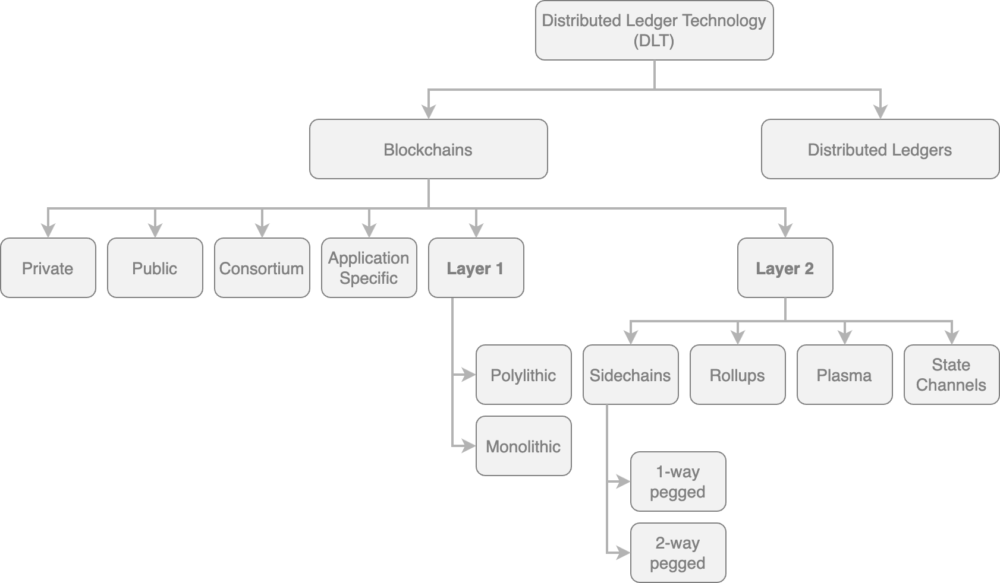

# Types of Blockchain

<figure><figcaption></figcaption></figure>

## Distributed Ledgers

> **Distributed Ledger:**
>
> `Shared databases`
>
> * distributed among its participants
> * replicated across multiple nodes, sites, or organizations
> * ledger can be either private or public

### Distributed Ledger Vs Blockchain&#x20;


**All blockchains** are fundamentally **distributed ledgers/shared databases**.

But not all distributed ledgers are necessarily blockchains.


* a distributed ledger does not necessarily consist of blocks of transactions to keep the ledger growing.
  * &#x20;R3’s [Corda](https://www.corda.net): a distributed ledger that does not use blocks of transaction
    * developed to record and manage agreements &#x20;
    * especially focused on the financial services industry
* a blockchain is a special type of shared database that comprises blocks of transactions.&#x20;
  * Bitcoin, Ethereum: make use of blocks composed of transactions to update the replicated shared database

## Shared Ledger&#x20;

> **Shared Ledger**:
>
> generic term that describe **any application or database** that is **shared by the public or a consortium**


**All blockchains** fall into the category of a **shared ledger**.


## Blockchains


[blockchains.md](blockchains.md)



[layer-1-blockchains.md](layer-1-blockchains.md)



[layer-2-blockchains.md](layer-2-blockchains.md)


