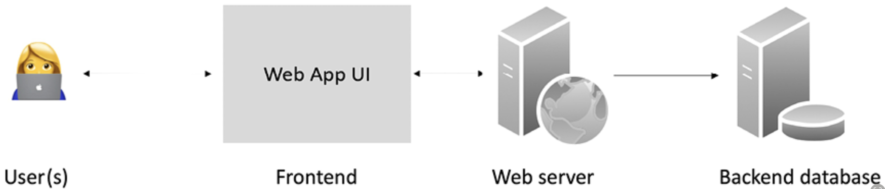

# DApps: Decentralized Applications

## `DApps`: Decentralized Applications

`DApp` software application that runs on a decentralized network such as distributed ledger/ blockchain

&#x20;**`DAOs`** | **`DACs`** | **`DOs`**&#x20;

* In recent years, the term DApp describes fully decentralized blockchain applications, including&#x20;
  * a web-based user interface,&#x20;
  * smart contracts, and&#x20;
  * the underlying blockchain


**DApps stats**: [https://thedapplist.com](https://thedapplist.com).


### `Type 1` DApps:

> **Type 1 DApps**:
>
> * run on their own dedicated blockchain
> * If required, they make use of a native token
>   * e.g: ETH on the Ethereum blockchain

E.g:&#x20;

* standard smart contract-based DApps running on Ethereum
* [`Ethlance`](https://ethlance.com) is a DApp that makes use of ETH to provide a job market

### `Type 2` DApps:&#x20;

> **Type 2 DApps**:
>
> * use an existing established blockchain
>   * make use of Type 1 blockchain and bear custom protocols and tokens

E.g:

* smart contract-based tokenization DApps running on the `Ethereum` blockchain
* [`DAI`](https://makerdao.com/en/):&#x20;
  * built on top of the Ethereum blockchain
  * but contains its own `stablecoins` and mechanism of distribution and control
* [`Golem`](https://golem.network):&#x20;
  * has its own token: `GNT`, and&#x20;
  * has its own transaction framework built on the `Ethereum` blockchain: it enables a decentralized marketplace for computing power where users share resources in a P2P network
* [`OMNI`](https://www.omnilayer.org) network
  * a software layer built on `Bitcoin`&#x20;
  * enables the trading of custom digital assets and currencies

### `Type 3` DApps:&#x20;

> **Type 3 DApps**:
>
> * Use the protocols of Type 2 DApps

* [`SAFE`](https://safenetwork.tech) Network&#x20;
  * uses the `OMNI` network protocol
* [`Tether: USDT`](https://tether.to) token
  * original `USDT` operates on the `OMNI` layer built on the `Bitcoin` network
    * `USDT`: Type 3 DApp
    * `OMNI` layer protocol: Type 2 DApp
    * `Bitcoin`: Type 1 DApp
  * also available as `ERC-20` tokens on the `Ethereum` network
    * `USDT`: Type 3 DApp
    * `Ethereum`: Type 1 DApp

## Criteria for a `DApp`&#x20;

For an application to be considered decentralized, it should be:

#### 1. Decentralized:&#x20;

* no single entity should control its operations
* any changes to the application must be driven by community consensus

#### 2. Open-source:&#x20;

* should be open source to ensure transparency and allow public scrutiny

#### 3. Cryptographically secure:&#x20;

* state transitions and data must be cryptographically secured and&#x20;
  * stored on a blockchain to eliminate central points of failure
* Encryption is not always required for confidentiality
  * but data must be protected against unauthorized manipulation.
* Services that should to be provided
  * data integrity
  * authentication&#x20;
  * non-repudiation&#x20;

#### 4. Incentive availability:&#x20;

* must use a cryptographic token to enable access and reward contributors
  * e.g: miners in Bitcoin
* In a `consortium chain`, this requirement can be flexible,&#x20;
  * with tokens used for value transfer rather than as a cryptocurrency

#### 5. Proof of value:&#x20;

* If applicable,  tokens must be generated by the decentralized application through consensus using a suitable cryptographic algorithm
* Token generation serves as proof of value for contributors
  * e.g for miners

## Operations of a `DApp`&#x20;

A DApp can **establish consensus** through algorithms like&#x20;

* Proof of Work (`PoW`) : &#x20;
  * has proven to be highly attack-resistant
    * demonstrated by the trust and success of the Bitcoin network
* Proof of Stake (`PoS`)

A DApp can **distribute tokens (or coins)** through methods such as&#x20;

* mining
* fundraising&#x20;
* development

## Design of a `DApp`&#x20;

<figure><figcaption>
Traditional (client-server) Application Architecture
</figcaption></figure>

Traditional apps have&#x20;

* `Frontend`: a user interface&#x20;
* `Web Server`: a web server / an application server&#x20;
* `Backend Database`

<figure><figcaption>
Generic DApp Architecture
</figcaption></figure>

DApp has

* `Frontend`: Thick client | Mobile app | web frontend (web user interface)
  * \[usually] web frontend written using a JavaScript framework like React / Angular
* `Middleware`: API
* `Backend`: blockchain&#x20;
  * smart contract that runs on the blockchain has the business logic

<table><thead><tr><th width="152" align="center">Entity</th><th align="center">DO</th><th align="center">DAO</th><th align="center">DAC</th><th align="center">DAS</th><th align="center">DApp</th></tr></thead><tbody><tr><td align="center">Autonomous?</td><td align="center">No</td><td align="center">Yes</td><td align="center">Yes</td><td align="center">Yes</td><td align="center">Yes</td></tr><tr><td align="center">Software?</td><td align="center">No</td><td align="center">Yes</td><td align="center">Yes</td><td align="center">Yes</td><td align="center">Yes</td></tr><tr><td align="center">Owned?</td><td align="center">Yes</td><td align="center">No</td><td align="center">Yes</td><td align="center">No</td><td align="center">Yes</td></tr><tr><td align="center">Capital ?</td><td align="center">Yes</td><td align="center">Yes</td><td align="center">Yes</td><td align="center">Possible</td><td align="center">Optional tokens</td></tr><tr><td align="center">Legal status?</td><td align="center">Yes</td><td align="center">Some work has begun</td><td align="center">Unsettled</td><td align="center">Unsettled</td><td align="center">Unsettled</td></tr><tr><td align="center">Cost</td><td align="center">High</td><td align="center">Low</td><td align="center">Low</td><td align="center">Low</td><td align="center">Use case dependent</td></tr></tbody></table>


In the future, these entities are **expected to be regulated and hold legal status** while maintaining their decentralized nature.

DAO legality: [The Legal Status of Decentralized Autonomous Organizations: Do DAOs Require New Business Structures? Some States Think So](https://fedsoc.org/commentary/fedsoc-blog/the-legal-status-of-decentralized-autonomous-organizations-do-daos-require-new-business-structures-some-states-think-so)



**Blockchain networks** like `Bitcoin`, `Ethereum`, `Solana`, `Hyperledger Fabric`, and `Quorum` can serve as decentralized platforms for building and hosting DApps.


