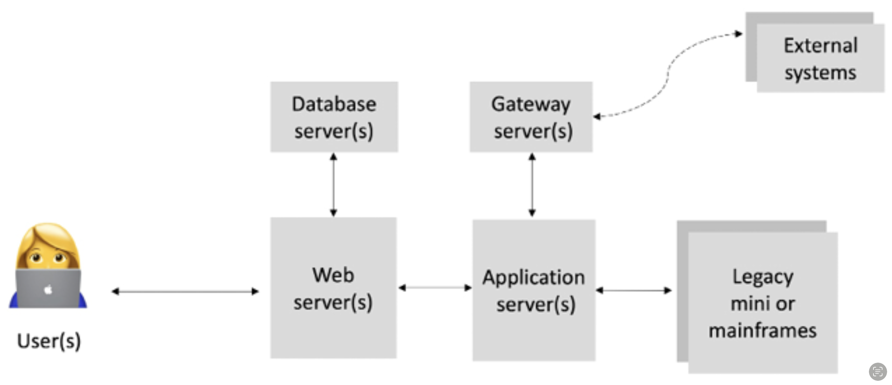

# Centralized Vs Distributed Vs Decentralized Networks

## Centralized Systems  &#x20;

> **Centralized System**:
>
> Conventional (client-server) IT systems&#x20;
>
> * a single authority controls and is solely in charge of all operations on the system
> * all users are dependent on a single source of service
> * database or application servers are under the control of a central authority, such as a system administrator

E.g: online service providers using centralized model to deliver services

* Google
* Amazon
* eBay
* Yahoo!&#x20;
* Apple’s App Store

## Distributed Systems

> **Distributed System**:
>
> data and computation are replicated across multiple nodes in a network in what users view as a single, coherent system

## Parallel Computing System

> **Parallel Computing System**:&#x20;
>
> computation is performed by all nodes simultaneously to achieve a single result
>
> * **System is centralized in nature**: there is still a central authority that has control over all nodes and governs processing
> * E.g: used in weather research and forecasting, simulation, and financial modeling

## Decentralized Systems

> **Decentralized System**:
>
> a type of network where nodes are not dependent on a single master node; instead, **control is distributed** between many nodes.

#### Analogous to a model&#x20;

* where each department in an organization is in charge of its own database server&#x20;
* thus, taking away the power from the central server and distributing it to the sub-departments, who manage their own databases

### Decentralized Consensus

> **Decentralized Consensus**:
>
> enables a user to **agree** on something **via a consensus algorithm** without the need for a central, trusted third party, intermediary, or service provider

* a significant innovation in the decentralized paradigm&#x20;
* came into play with Bitcoin

## Centralized Vs Distributed Vs Decentralized Networks

<figure><figcaption>
Different types of networks/systems [1]
</figcaption></figure>

<figure><figcaption>
Different types of networks/systems [1]
</figcaption></figure>


* Traditional Centralized System:&#x20;
  * has a central controller&#x20;
  * represents the usual client/server model
* Distributed System:
  * still have a central controller
  * but the system comprises many dispersed nodes
* Decentralized System:
  * no controller controlling the networks



**Decentralized** and **Distributed** Network

**Similar**: from a topological point of view

**Key Difference**: Decentralized system **doesn’t have a central authority** that controls the network


<figure><figcaption>
Traditional Distributed System [1]
</figcaption></figure>


A **traditional distributed system**:

comprises **many servers performing different roles**.


<figure><figcaption>
Blockchain-based Decentralized System [1]
</figcaption></figure>


**A blockchain-based decentralized system**:

decentralized system (based on blockchain) where an **exact replica** of the applications and data is maintained across the entire network on each participating node

\*\* notice the direct P2P connections and the exact replicas of blocks (data)


<table><thead><tr><th width="167" align="center">Feature</th><th width="247" align="center">Centralized</th><th align="center">Decentralized</th></tr></thead><tbody><tr><td align="center"><strong>Ownership</strong></td><td align="center">Service Provider</td><td align="center">All users</td></tr><tr><td align="center"><strong>Architecture</strong></td><td align="center">Client-Server</td><td align="center">Distributed: different topologies</td></tr><tr><td align="center"><strong>Security</strong></td><td align="center">Basic</td><td align="center">More Secure</td></tr><tr><td align="center"><strong>High availability</strong></td><td align="center">No</td><td align="center">Yes</td></tr><tr><td align="center"><strong>Fault tolerance</strong></td><td align="center">Limited; single point of failure * can be improved by data replication</td><td align="center">Highly tolerant; as service is replicated and since the system is distributed and decentralized, no single participant could single-handedly game the system and gain a disproportionate advantage</td></tr><tr><td align="center"><strong>Collusion resistance</strong> </td><td align="center">Basic; because it's under the control of a group or even a single individual</td><td align="center">Highly resistant; as consensus algorithms ensure defence against adversaries</td></tr><tr><td align="center"><strong>Application architecture</strong></td><td align="center">Single application</td><td align="center">Application replicated across all nodes on the network</td></tr><tr><td align="center"><strong>Trust</strong></td><td align="center">Consumers must trust the service provider; i.e. a trusted third party</td><td align="center">No mutual trust required</td></tr><tr><td align="center"><strong>Cost for consumer</strong></td><td align="center">High</td><td align="center">Low</td></tr></tbody></table>

### **Fault Tolerance: Centralized Vs Decentralized**&#x20;

> **Fault Tolerance**:&#x20;
>
> the ability of a system to continue operating even if some of its components fail


Centralized system is considerably less fault-tolerant than a decentralized distributed blockchain system


<table data-header-hidden><thead><tr><th width="268"></th><th width="193"></th><th></th></tr></thead><tbody><tr><td>
<strong>Centralized</strong> 

basic <strong>client/server</strong> architecture 

with only one central server or perhaps just a primary and the backup server providing services 
</td><td><strong>&#x3C;</strong> is considerably <strong>less fault-tolerant than</strong> </td><td>a <strong>Decentralized distributed blockchain</strong> system As blockchains are replicated across usually hundreds and thousands of replicas (participants) worldwide in different geographic locations</td></tr></tbody></table>

