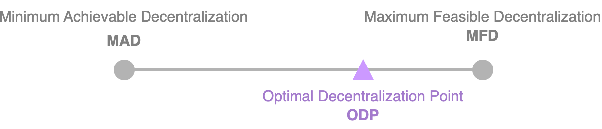

# Quantifying Decentralization

## Scale of Decentralization&#x20;

<table><thead><tr><th width="190" align="center">Fully Centralized</th><th width="47" align="center">-></th><th width="258" align="center">Semi Decentralized</th><th width="48" align="center">-></th><th align="center">Fully Decentralized</th></tr></thead><tbody><tr><td align="center">Central intermediaries are in control</td><td align="center"></td><td align="center">
Intermediaries compete 

intermediaries/ service providers are selected based on reputation or voting
</td><td align="center"></td><td align="center">No intermediaries are required</td></tr><tr><td align="center">e.g: the current financial system</td><td align="center"></td><td align="center">e.g: multiple service providers compete to win a contract </td><td align="center"></td><td align="center">e.g: Bitcoin, Ethereum</td></tr><tr><td align="center"></td><td align="center"></td><td align="center">partial decentralization</td><td align="center"></td><td align="center">Complete disintermediation is achieved</td></tr></tbody></table>

## Attainable Decentralization

— Another angle of decentralization spectrum

<figure><figcaption>
Attainable Decentralization Spectrum
</figcaption></figure>

Range from Minimum Achievable Decentralization (`MAD`) to Maximum Feasible Decentralization (`MFD`) with an Optimal Decentralization Point (`ODP`) **for a given use case**

> **Optimal Decentralization Point** (`ODP`) :
>
> * Maximum decentralization is achieved with as little centralization as possible so that it is most favourable for the specific use case under consideration

## Measure Level of Decentralization

> “**`Nakamoto coefficient`**” \[5]
>
> represents the number of entities that are required to be controlled to compromise a blockchain network
>
>
>
> ⬆️ Nakamoto coefficient **->** ⬆️ decentralization of the network
>
> — The higher the value of Nakamoto coefficient -> The more decentralized the network is


To track Nakamoto coefficient -> [https://nakaflow.io/](https://nakaflow.io/)


A decentralized system is made up of multiple subsystems, and **if any subsystem is centralized**, the **overall system is** considered **centralized**.

* E.g: Blockchain is composed of several subsystems including miners, clients, developers, exchanges, nodes, ownership. Due to mining pools' monopoly, Bitcoin can be considered centralized.

This metric enumerates subsystems of a decentralized system, **calculates** **how many entities are required to be compromised to gain control of each subsystem**, and uses minimum values to determine effective decentralization.

* E.g: Ethereum is considered centralized as only a few developers commit most of the time, resulting in a developer centralization.

