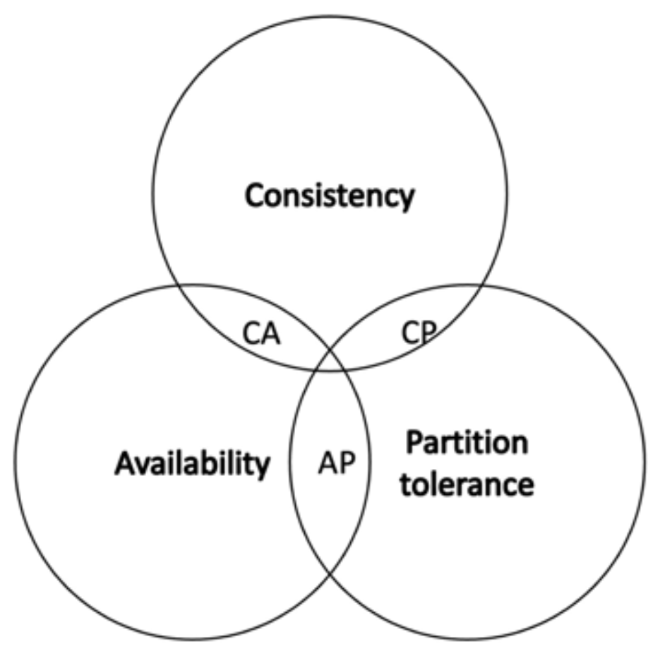

# CAP Theorem

— Introduced by Eric Brewer in 1998 as a conjecture

— Proven as a theorem by Seth Gilbert and Nancy Lynch in 2002

> Any distributed system **cannot have all** 3 of the much-desired properties **simultaneously**. Only 2 properties at a time can be attained.
>
> 1. **Consistency**
> 2. **Availability**
> 3. **Partition Tolerance**

## Consistency

> Ensures that all nodes in a distributed system have a **`single, current`**`(up-to-date)`**`, and identical copy of data`**` ``(same shared state)`.
>
> * Known as `State Machine Replication` (**SMR**).
> * Achieved using **consensus algorithms**.

## Availability

> The **nodes** in the system are&#x20;
>
> * **up**,&#x20;
> * **accessible**, and&#x20;
> * are **accepting** incoming **requests** and&#x20;
> * **responding** **with data** without any failures **as and when required**.
>
>
>
> — Data is available at each node and nodes are responding to requests.&#x20;

## Partition Tolerance&#x20;

> Ensures that if a group of nodes is **unable to communicate** with other nodes **due to network or node failures**, the distributed system continues to operate correctly.
>
> * network failure -> communication failure or delay

## CAP Theorem

<figure><figcaption>
CAP Theorem [1]
</figcaption></figure>

1. If we opt for **CP** (consistency and partition tolerance), we sacrifice availability.&#x20;
2. If we opt for **AP** (availability and partition tolerance), we sacrifice consistency.&#x20;
3. ❗If we opt for **AC** (availability and consistency), we sacrifice partition tolerance.

## CAP Theorem in practice

❗Note that AC does not really exist.

> `In the case of a`` `**`network partition`**`, a distributed system is either`` `**`available`` ``or consistent`**`.`
>
> ╰**---**➤ As **network partitions cannot be ignored**, the choice is between consistency or availability when a network partition occurs.

#### Applying CAP theorem to distributed system with 2 nodes

* `Consistency`: achieved if both nodes have the same shared state; they have the same up-to-date copy of the data
* `Availability`: achieved if both nodes are up and running and responding with the latest copy of data
* `Partition tolerance`: achieved if, despite communication failure or delay between nodes, the network (distributed system) continues to operate.

Say a partition occurs in this system and nodes con no longer communicate with each other.

* If newly updated data comes in now, it can only be update on one node.
  * If the node accepts the update,
    * then only one node in the network is updated -> consistency s lost.
  * If the node rejects the update,
    * it results in a loss of availability.

╰**---**➤ This means that either availability or consistency is unachievable due to the network partition.
